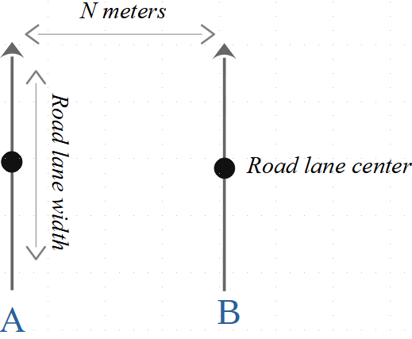
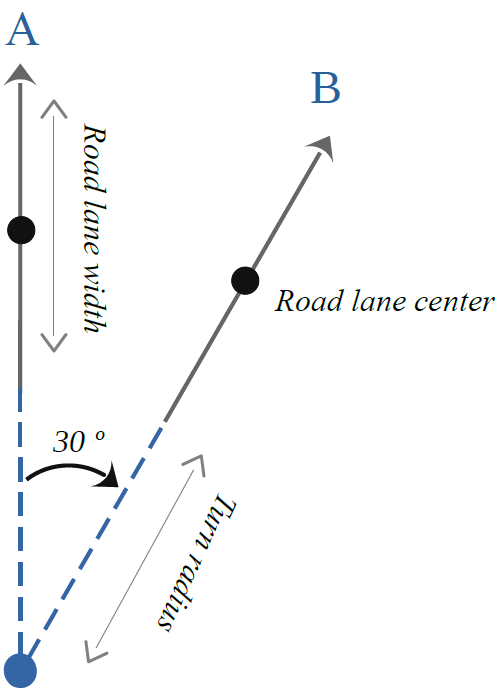

# Cyber-Physical Systems Testing Competition #
Starting this year, the [SBST Workshop](https://sbst21.github.io/) offers a challenge for software testers who want to work with self-driving cars in the context of the usual [tool competition](https://sbst21.github.io/tools/).

This repository represents one of the submissions to the competition. We have created a "SWAT" test case generation tool for self-drivng cars CPS, integrated with the code pipeline of the competion.
To launch the tool code, you should download the code from https://github.com/se2p/tool-competition-av competition repository and use the competition.py file, indication the location of the path of the "sawt_gen" module. Name of the (main) class implementing the test generator is SwatTestGenerator.

Here's an example of the command to use to lauch the SWAT tool (integrated with the competition code pipeline):

``` 
python competition.py \
        --visualize-tests \
        --time-budget 100 \
        --executor mock \
        --map-size 200 \
        --module-name  swat_gen.swat_generator \
        --class-name SwatTestGenerator
``` 
## SWAT tool principle of opereration
The output of the tool is a set of points defined in a two-dimensional squared map with a predefined size.
We define the points by applying affine transformations to a vector, whose length corresponds to a road lane width.
We use three types of transformations:
* turn left by n degrees
* turn right by n degrees
* go straight n meters
An example of performing the transformations to a vector to move from positon A to position B is shown in the figures below. The vector middle points are then used to define the road.

Turning left| Going straight | Turning right
:-------------------------:|:-------------------------:|:-------------------------:
  |  | 

The sets of transformations e.g. "go straight 10 meters", "turn left 30 degrees", "turn right 50 degrees" are generated using the Markov chain with 3 corresponding states (module ""). The roads are generated after executing the transformations in the module  


Turning right

Going straight
